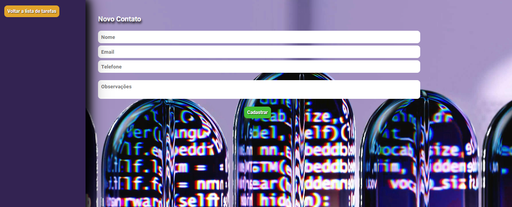

## 📇 Meus Contatos

### 📇 Funcionalidades

- Cadastro de contatos com nome, telefone, e-mail e observações.
- Edição de contatos existentes.
- Remoção de contatos da agenda.
- Filtragem de contatos por nome, telefone ou e-mail.

### 🛠 Ferramentas Utilizadas

#### Linguagens e Frameworks

- JavaScript (ES6+)
- React.js
- Redux
- Redux Toolkit

#### Gerenciamento de Estado 🔄

O projeto utiliza o React com Redux para o gerenciamento de estado. O Redux é uma biblioteca de gerenciamento de estado previsível para aplicativos JavaScript, enquanto o Redux Toolkit foi utilizado para facilitar a configuração do Redux, fornecendo uma maneira mais eficiente de escrever código Redux, com menos configuração.

O estado da aplicação é gerenciado centralmente pelo Redux, o que facilita o compartilhamento de dados entre os componentes e o mantém em sincronia conforme as ações são despachadas.

Principais conceitos:
- Reducers: para atualizar o estado da aplicação em resposta a ações específicas.
- Actions: para descrever as mudanças de estado na aplicação.
- Dispatchers: para despachar as actions e iniciar as mudanças de estado.

O Redux também é integrado ao React por meio do pacote `react-redux`, que permite conectar os componentes React ao store Redux e acessar o estado da aplicação e despachar actions em resposta a eventos do usuário ou ações assíncronas.

#### 📚 Bibliotecas Adicionais

- react-redux: Utilizado para conectar o React com o Redux.
- @reduxjs/toolkit: Fornece uma maneira mais eficiente de escrever código Redux, com menos configuração.
- styled-components: Utilizado para estilização dos componentes.

### 🖼 Capturas de Tela

#### Tela inicial:

#### Tela para cadastrar novo cadastro:

### 🚀 Como Executar o P

## 📇 Funcionalidades

- Cadastro de contatos com nome, telefone, e-mail e observações.
- Edição de contatos existentes.
- Remoção de contatos da agenda.
- Filtragem de contatos por nome, telefone ou e-mail.

## 🛠 Ferramentas Utilizadas

### Linguagens e Frameworks

- JavaScript (ES6+)
- React.js
- Redux
- Redux Toolkit

## Gerenciamento de Estado 🔄

O projeto utiliza o React com Redux para o gerenciamento de estado. O Redux é uma biblioteca de gerenciamento de estado previsível para aplicativos JavaScript, enquanto o Redux Toolkit foi utilizado para facilitar a configuração do Redux, fornecendo uma maneira mais eficiente de escrever código Redux, com menos configuração.

O estado da aplicação é gerenciado centralmente pelo Redux, o que facilita o compartilhamento de dados entre os componentes e o mantém em sincronia conforme as ações são despachadas.

Principais conceitos:
- Reducers: para atualizar o estado da aplicação em resposta a ações específicas.
- Actions: para descrever as mudanças de estado na aplicação.
- Dispatchers: para despachar as actions e iniciar as mudanças de estado.

O Redux também é integrado ao React por meio do pacote `react-redux`, que permite conectar os componentes React ao store Redux e acessar o estado da aplicação e despachar actions em resposta a eventos do usuário ou ações assíncronas.

### 📚 Bibliotecas Adicionais

- react-redux: Utilizado para conectar o React com o Redux.
- @reduxjs/toolkit: Fornece uma maneira mais eficiente de escrever código Redux, com menos configuração.
- styled-components: Utilizado para estilização dos componentes.

## 🖼 Capturas de Tela

### Tela inicial:

### Tela para cadastrar novo cadastro:

## 🚀 Como Executar o Projeto

1. Clone este repositório.
2. Instale as dependências do projeto com `npm install`.
3. Execute o projeto com `npm start`.

